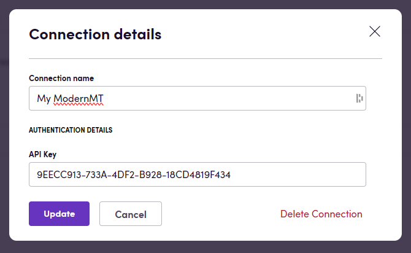
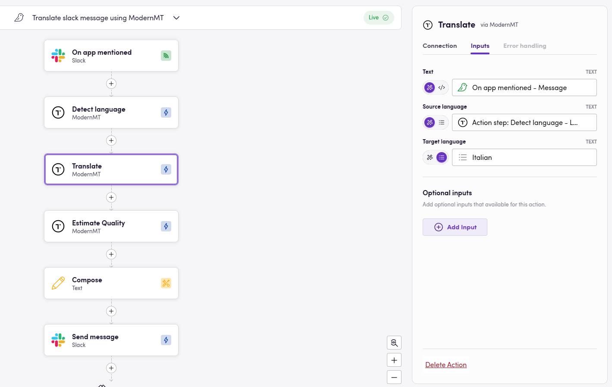

# Blackbird.io ModernMT

Blackbird is the new automation backbone for the language technology industry. Blackbird provides enterprise-scale automation and orchestration with a simple no-code/low-code platform. Blackbird enables ambitious organizations to identify, vet and automate as many processes as possible. Not just localization workflows, but any business and IT process. This repository represents an application that is deployable on Blackbird and usable inside the workflow editor.

## Introduction

<!-- begin docs -->

ModernMT is a more human machine translation. It improves from corrections and adapts to the context of the document. Its features include translation using weighted translation memories, hints and glossaries.

## Before setting up

Before you can connect you need to make sure that:

- You have a ModernMT account.
- Your ModernMT account has a [plan](https://modernmt.com/dashboard) that allows you to generate a License Key.

## Connecting

1. Navigate to apps and search for ModernMT. If you cannot find ModernMT then click _Add App_ in the top right corner, select ModernMT and add the app to your Blackbird environment.
2. Click _Add Connection_.
3. Name your connection for future reference e.g. 'My ModernMT'.
4. Enter your ModernMT [license key](https://modernmt.com/dashboard).
5. Click _Authorize connection_.

## Actions

### Translation

- **Translate** translates a segment into a given language. It can optionally take arguments for glossaries, contexts, hints, and more. See the [ModernMT documentation](https://www.modernmt.com/api/#translate-text) for all the options.
- **Translate multiple** behaves the same as translate, but with multiple segments rather than just one.

### Quality estimation

- **Estimate quality** takes a source and translation and returns a score between 0 and 1 indicating the machine translation quality.
- **Estimate XLIFF quality** provides quality estimation data for all segments in an XLIFF 1.2 file. Mandatory input data include the translated XLIFF file, source and target language values. As an output, an Average Score is provided, which is the average of the quality scores for all segments in the file. Additionally, all translation units get appeneded with their individual score which is added to the `extradata` attribute in the XLIFF file. Optionally, you can add _Threshold_, _New Target State_ and _Condition_ input parameters to the Blackbird action to change the target state value of segments meeting the desired criteria.

Examples:

Setting the optional input values as shown in the image below will result in all segments with a score above 0.9 to have their target state values updated to “final”.

Similarly, the setup below will cause all the segments with a quality score below or equal to 0.6 to have their target state value changed to “needs-review-translation”.

### Language detection

- **Detect langauge** returns a language code given a segment.
- **Detect multiple languages** behaves the same as detect language, but for multiple segments.

### Context Vectors

- **Get context vector from text** returns a context vector that can be used for translation actions. For details about context vectors see the [ModernMT documentation](https://www.modernmt.com/api/#context-vector).

### Memories

- **Get memory**, **Create memory**, **Update memory**, **Delete memory** are actions that can be used to manage the existing memories and metadata like name and description.
- **Add translation to memory** and **Update memory translation pair** can be used to add/update new sentence-translation pairs into an existing memory.
- **Import memory from tmx** allows you to add new sentence-translation pairs in bulk through existing TMX files.

## Example

This example show a simple bird that translates incoming Slack messages, performs a quality estimation and then send the translation and quality estimation together back as a Slack message.

## Feedback

Feedback to our implementation of ModernMT is always very welcome. Reach out to us using the [established channels](https://www.blackbird.io/), or create an issue.

<!-- end docs -->
